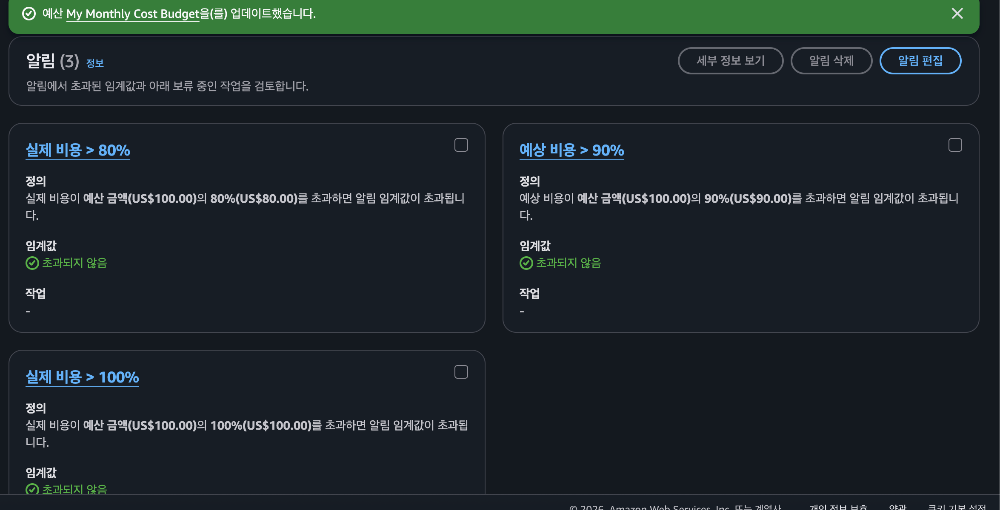
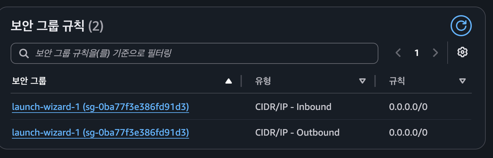

# member-api

팀원 정보를 저장하고 조회할 수 있는 Spring Boot 기반 API 서버입니다.

## 배포 정보

- EC2 Public IP: 52.78.132.180
- Health Check URL: http://52.78.132.180:8080/actuator/health





## 기술 스택

- Java 17
- Spring Boot
- Spring Data JPA
- Spring Boot Actuator
- H2 Database
- MySQL
- AWS EC2
- Docker

## 주요 기능

- 팀원 정보 저장
- 팀원 정보 조회
- API 요청 로그 출력
- 전역 예외 처리
- Actuator Health Check 제공

## API 명세

### 팀원 저장

```http
POST /api/members
Request Body:

{
  "name": "홍길동",
  "age": 25,
  "mbti": "INTJ"
}
팀원 조회
GET /api/members/{id}
Profile 구성
local: H2 Database 사용
prod: MySQL 사용
Health Check
GET /actuator/health
응답 예시:

{
  "status": "UP"
}
배포 구성
VPC 내 Public Subnet과 Private Subnet을 분리했습니다.
EC2는 Public Subnet에 생성했습니다.
애플리케이션은 EC2에서 JAR 파일로 실행했습니다.
운영 DB는 MySQL을 사용했습니다.

🚀 레벨 2 과제 요약 및 결과
프로젝트: Member-API (DB 분리 및 보안 배포)

배포 환경: AWS EC2(t4g.small), RDS(MySQL)

보안: IAM Role(EC2-ParameterStore-Role)을 통해 Access Key 노출 없이 DB 정보 및 파라미터 안전하게 주입

설정 관리: application-prod.yml에서 DB 정보를 제거하고, AWS Parameter Store로 중앙 관리

검증: http://52.78.132.180:8080/actuator/info 접속 시 {"team-name":"my-team"} 정상 출력

트러블슈팅: EC2 내 Java 17 설치, Gradle 데몬 중지(--stop) 후 재빌드, 설정 파일에서 ${DB_URL} 제거하여 파라미터 주입 문제 해결
